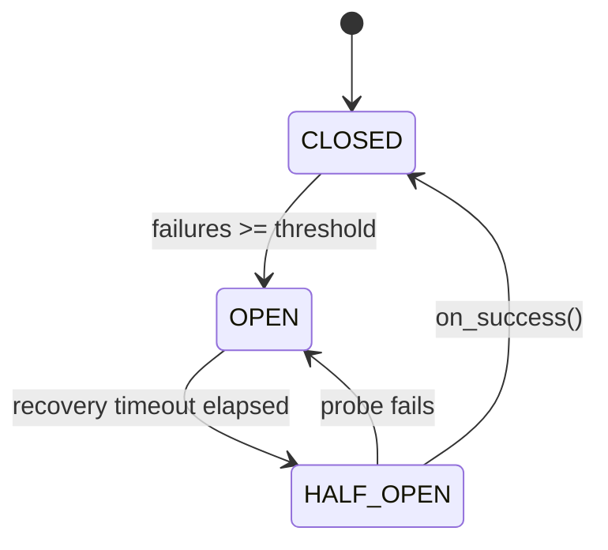

# API Gateway

A reverse-proxy API gateway built with FastAPI, httpx and Redis. Handles routing,
per-IP rate limiting, response caching, JWT auth and circuit breaking, with all
shared state in Redis so the gateway scales horizontally. Deployable via Docker
Compose or Kubernetes.


## Features

| Phase | Feature | Details |
|-------|---------|---------|
| 1 | Dynamic Proxy | Routes by path prefix; supports GET/POST/PUT/DELETE/PATCH |
| 2 | Logging Middleware | JSON-structured logs to stdout + rotating file |
| 3 | Rate Limiting | Redis sliding-window counter; per-IP, per-route limits; temp bans |
| 4 | Retries | Exponential backoff; configurable retry-on status codes |
| 5 | Circuit Breaker | CLOSED → OPEN → HALF-OPEN; shared state via Redis |
| 6 | Config System | YAML file + environment variable overrides |
| ★ | JWT Auth | Bearer token validation; optional per-route |
| ★ | Response Cache | Redis GET cache; TTL configurable; admin invalidation |
| ★ | Admin API | /admin/* control plane for live inspection & control |
| ★ | Mock Service | Built-in downstream simulator with failure injection |

## Project Structure

```
.
├── k8s/                       # Kubernetes manifests
│   ├── 00-namespace.yaml
│   ├── 10-redis.yaml          # PVC + Deployment + Service
│   ├── 20-gateway-config.yaml # ConfigMap + Secret
│   ├── 30-gateway.yaml        # Deployment + Service
│   └── 40-mock-service.yaml   # Deployment + Service
├── ruff.toml                  # Explicit lint rule selection
│
└── gateway/
    ├── main.py                # FastAPI app, lifespan, middleware wiring
    ├── config.yaml            # Route table + all tunable settings
    ├── mock_service.py        # Fake downstream (users/orders/echo/slow)
    ├── requirements.txt
    ├── Dockerfile
    ├── Dockerfile.mock
    ├── docker-compose.yml
    │
    ├── core/
    │   ├── config.py          # Pydantic settings loader (YAML + env vars)
    │   ├── logging.py         # JSON formatter + rotating file handler
    │   └── redis_client.py    # Shared async Redis pool
    │
    ├── services/
    │   ├── proxy.py           # Phase 1+4: httpx proxy + retry logic
    │   ├── rate_limiter.py    # Phase 3: Redis INCR sliding-window
    │   ├── circuit_breaker.py # Phase 5: CLOSED/OPEN/HALF-OPEN FSM
    │   ├── cache.py           # Bonus: Redis GET cache
    │   └── auth.py            # Bonus: JWT create/decode/dependency
    │
    ├── routers/
    │   ├── proxy.py           # Catch-all /{path} → route match + forward
    │   └── admin.py           # /admin/* + /auth/token endpoints
    │
    ├── models/
    │   └── schemas.py         # Pydantic request/response models
    │
    ├── utils/
    │   └── middleware.py      # Phase 2: LoggingMiddleware (ASGI)
    │
    └── tests/
        └── test_gateway.py    # 18 unit + integration tests
```

## Prerequisites

- **Docker & Docker Compose** : for running the full stack
- **Python 3.12** : for local development (the image is pinned to `python:3.12.14-slim`)
- **Redis 7+** : provided via Docker Compose, or run separately
- **minikube + kubectl** : optional, for the Kubernetes deployment

## Quick Start

### Option A : Docker Compose (recommended)

```bash
cd gateway
docker compose up --build
```

Services:

- Gateway → http://localhost:8000
- Mock service → http://localhost:8010
- Redis → localhost:6379

### Option B : Local dev

```bash
# 1. Start Redis
docker run -d -p 6379:6379 redis:7-alpine

# 2. Install deps
cd gateway
pip install -r requirements.txt

# 3. Start mock downstream
uvicorn mock_service:app --port 8010 &

# 4. Start gateway
uvicorn main:app --port 8000 --reload
```

### Option C : Kubernetes

See [Kubernetes deployment](#kubernetes-deployment) below.

## Configuration (config.yaml)

### Adding a route

```yaml
routes:
  - path: "/payments"          # matched by prefix
    target: "http://pay-service:8005"
    rate_limit: 30             # req/min per IP (overrides default)
    strip_prefix: false        # keep /payments in the forwarded URL
    methods: ["GET", "POST"]
    auth_required: true        # require Bearer JWT
```

`strip_prefix` decides what the downstream actually receives. With `false`,
a request to `/payments/invoices` is forwarded as `/payments/invoices`; with
`true`, as `/invoices`. Set it to match what the downstream serves, or every
request 404s.

### Tuning rate limits

```yaml
rate_limiting:
  enabled: true
  default_limit: 100           # requests per window
  window_seconds: 60
  ban_duration_seconds: 300    # how long to block an IP after manual ban
```

### Tuning the circuit breaker

```yaml
circuit_breaker:
  failure_threshold: 5         # consecutive failures before OPEN
  recovery_timeout_seconds: 30 # time in OPEN before trying HALF-OPEN
  half_open_max_calls: 3       # probe calls allowed in HALF-OPEN
```

### Environment variable overrides

| Variable | Description |
|----------|-------------|
| `REDIS_HOST` | Redis hostname |
| `REDIS_PORT` | Redis port |
| `JWT_SECRET_KEY` | Secret for JWT signing |

Environment variables take precedence over `config.yaml`. In Kubernetes the
signing key comes from a Secret rather than the YAML file.

## API Reference

### Authentication

```bash
# Get a JWT
curl -X POST http://localhost:8000/auth/token \
  -H "Content-Type: application/json" \
  -d '{"username": "alice", "password": "any"}'

# Use it
curl http://localhost:8000/users \
  -H "Authorization: Bearer <token>"
```

### Proxy requests (via mock service)

The `/mock` route is unauthenticated, so these need no token.

```bash
# List users
curl http://localhost:8000/mock/users

# Echo any request
curl -X POST http://localhost:8000/mock/echo \
  -H "Content-Type: application/json" \
  -d '{"hello": "world"}'

# Trigger a slow response (tests retry/timeout)
curl "http://localhost:8000/mock/slow?delay=3"

# Force a 500 (tests circuit breaker)
curl http://localhost:8000/mock/status/500
```

### Admin endpoints

```bash
# Health check
curl http://localhost:8000/admin/health

# Live metrics (routes, circuit states, config)
curl http://localhost:8000/admin/metrics

# Circuit breaker states
curl http://localhost:8000/admin/circuit-breakers

# Reset all circuits
curl -X POST http://localhost:8000/admin/circuit-breakers/reset

# Rate-limit stats for an IP
curl http://localhost:8000/admin/rate-limit/1.2.3.4

# Manually ban an IP for 10 minutes
curl -X POST "http://localhost:8000/admin/rate-limit/1.2.3.4/ban?duration=600"

# Invalidate cache
curl -X POST "http://localhost:8000/admin/cache/invalidate?pattern=*"
```

### Failure injection (mock service)

```bash
# Make 70% of mock requests fail with 503
curl -X POST "http://localhost:8010/mock/failure-mode?enabled=true&rate=0.7&status=503"

# Watch the circuit breaker open after 5 failures
watch -n1 'curl -s http://localhost:8000/admin/circuit-breakers | python3 -m json.tool'

# Restore normal operation
curl -X POST "http://localhost:8010/mock/failure-mode?enabled=false"
```

## Response Headers

Every proxied response includes:

| Header | Description |
|--------|-------------|
| `X-Request-ID` | UUID per request; traceable end-to-end |
| `X-RateLimit-Limit` | Effective limit for this route |
| `X-RateLimit-Remaining` | Requests left in the current window |
| `X-Response-Time-Ms` | Total gateway latency in milliseconds |
| `X-Cache` | `HIT` when served from Redis cache |

## Running Tests

Tests use an in-memory Redis mock, no external infrastructure required.

```bash
cd gateway
PYTHONPATH=. pytest tests/ -v --asyncio-mode=auto
```

```
18 passed in 2.11s
```

Test coverage:

- Rate limiter: allow, block, ban, reset
- Circuit breaker: all 3 state transitions
- Proxy: 200 forward, timeout retry, 502 exhaustion
- Auth: token create/decode, invalid token rejection
- Integration: health, token endpoint, 404 for unknown routes

## Kubernetes deployment

The `k8s/` directory holds a full port of the Compose stack: Namespace,
Deployments, Services, a ConfigMap, a Secret and a PVC for Redis. Verified
on minikube.

```bash
minikube start
eval $(minikube docker-env)
docker build -t gateway:local      -f gateway/Dockerfile      gateway/
docker build -t mock-service:local -f gateway/Dockerfile.mock gateway/

kubectl apply -f k8s/
kubectl -n gateway get pods -w

kubectl -n gateway port-forward svc/gateway 8000:8000
```

### What changed in the port

| Compose | Kubernetes |
|---------|------------|
| `ports: "8000:8000"` | Service + Ingress (or `port-forward` for local access) |
| `./config.yaml:/app/config.yaml:ro` | ConfigMap, mounted via `subPath` |
| `JWT_SECRET_KEY` env literal | Secret, consumed via `secretKeyRef` |
| `healthcheck:` | `readinessProbe` + `livenessProbe` |
| `depends_on: service_healthy` | nothing; see below |
| `restart: unless-stopped` | nothing; the controller does this by default |
| `./logs:/app/logs` | dropped; container logs go to stdout |

Notes on the non-obvious decisions:

- **Redis uses `strategy: Recreate`.** A ReadWriteOnce volume mounts on one node
  at a time, so the default RollingUpdate deadlocks waiting for the old pod to
  release it. A StatefulSet with `volumeClaimTemplates` is the right answer for
  a Redis *cluster*; for a single instance it is overkill.
- **`subPath` mounts do not hot-reload.** Editing the ConfigMap requires
  `kubectl rollout restart deploy/gateway` for the change to take effect.
- **There is no `depends_on` equivalent.** Gateway pods start before Redis is
  ready, crash-loop, and recover once Redis answers. The system converges rather
  than sequences. An initContainer would enforce ordering if it were needed.
- **Persistence is arguably unnecessary.** The PVC is attached and AOF is on, but
  this workload is rate-limit counters and a response cache: losing them on
  restart costs one window and a cold cache. Compose runs Redis with `--save ""`
  for exactly that reason.

### Shared state across replicas

Circuit breaker state lives in Redis, so a breaker tripped by one pod is visible
to all of them. With the gateway scaled to 4 replicas and failure injection
enabled on the downstream:

```bash
kubectl -n gateway scale deploy/gateway --replicas=4

kubectl -n gateway exec deploy/gateway -- \
  curl -sX POST "http://mock-service:8010/mock/failure-mode?enabled=true&rate=1.0&status=503"

# 6 requests through a single pod, threshold is 5
for i in $(seq 1 6); do curl -s -o /dev/null http://localhost:8000/mock/users; done

# every replica reports OPEN
for p in $(kubectl -n gateway get pods -l app=gateway -o name); do
  kubectl -n gateway exec $p -- curl -s http://localhost:8000/admin/circuit-breakers
done
```

Three of those pods never saw a failure. They read the state out of Redis.

## CI/CD

### CI : Continuous Integration

Triggers on every push to `main` or `dev`, and on every pull request. Completes
in under 25 seconds.

- Spins up a Redis 7 service container
- Installs all dependencies
- Lints with `ruff` (pinned; rule selection in `ruff.toml`)
- Runs all 18 tests with `pytest`

Workflow: `.github/workflows/main.yml`

### CD : Continuous Deployment

> **Status:** the AWS deployment target has been decommissioned. The pipeline is
> retained as reference and no longer runs against live infrastructure.

- Builds the gateway Docker image → pushes to AWS ECR (tag: `:gateway`)
- Builds the mock service image → pushes to AWS ECR (tag: `:mock`)
- SSHs into EC2, pulls the new images, restarts the stack via `docker-compose`

Workflow: `.github/workflows/cd.yml`

### Infrastructure (as deployed)

| Component | Details |
|-----------|---------|
| Compute | AWS EC2 `t3.micro` : Ubuntu 24.04 (eu-north-1) |
| Container registry | AWS ECR : single repo, two tags (`:gateway`, `:mock`) |
| Orchestration | `docker-compose` : Redis + Gateway + Mock service |
| Secrets | GitHub Actions secrets : AWS keys, SSH key, ECR URI |
| Cost protection | AWS Budget alert + CloudWatch alarm auto-stopping the instance on sustained high CPU |

### Pinned dependencies

Both the base image and `ruff` are pinned, after each broke the build without a
code change behind it:

- `python:3.12-slim` moved to a patch release where `logging.config.fileConfig`
  rejects an empty file, and the gateway's `--log-config /dev/null` flag started
  crashing the container on startup. Now pinned to `python:3.12.14-slim`.
- `ruff` was installed unpinned in CI; a release widened the default rule set and
  turned the build red. Now pinned, with an explicit `select` in `ruff.toml` so
  the lint contract lives in the repo.

## Architecture Notes

### Request lifecycle

```
Request
  → LoggingMiddleware (log + attach request_id)
  → router match (longest prefix)
  → method check
  → JWT validation (if auth_required)
  → rate limit check (Redis INCR + EXPIRE via Lua)
  → cache lookup (Redis GET, GET requests only)
  → circuit breaker guard (before_call)
  → httpx proxy with retry loop
  → circuit breaker update (on_success / on_failure)
  → cache write (successful GET responses)
  → add X-* response headers
  → LoggingMiddleware (log response + latency)
Response
```

### Why Lua for rate limiting?

The `INCR` + `EXPIRE` must be atomic. Without Lua, a race between two requests
could both see `count == 1` and both set the TTL, potentially resetting the
window. The Lua script runs atomically on the Redis server.

### Circuit breaker state machine



State is stored in Redis so all gateway replicas share it, with no split brain
across replicas. Verified under horizontal scaling; see
[Shared state across replicas](#shared-state-across-replicas).

## Author

**Dimitrios Dalaklidis**
