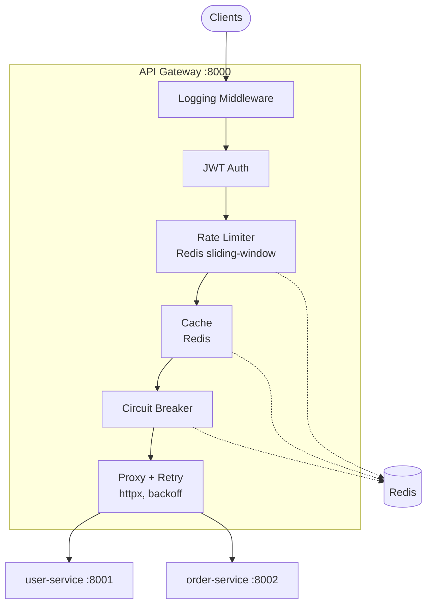
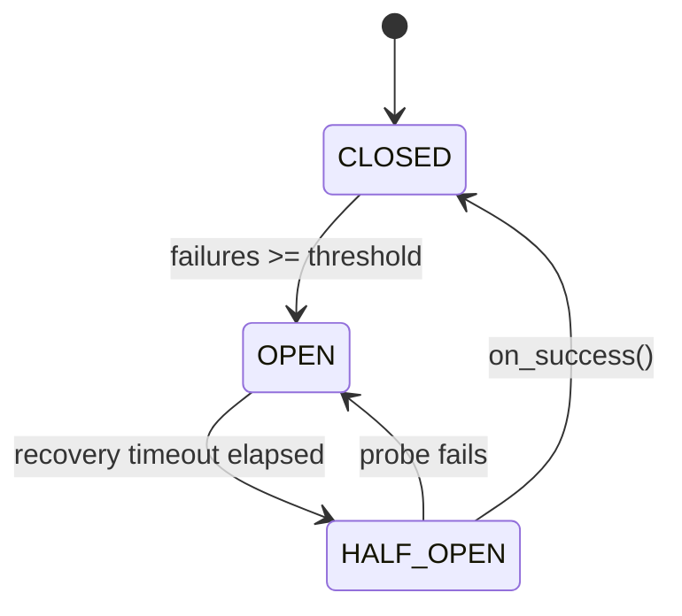

# API Gateway

A reverse-proxy API gateway built with FastAPI, httpx and Redis. Handles routing,
per-IP rate limiting, response caching, JWT auth and circuit breaking, with all
shared state in Redis so the gateway scales horizontally. Runs under Docker
Compose or Kubernetes; the AWS deployment target is defined as Terraform.



## Features

| Phase | Feature | Details |
|-------|---------|---------|
| 1 | Dynamic Proxy | Routes by path prefix; supports GET/POST/PUT/DELETE/PATCH |
| 2 | Logging Middleware | JSON-structured logs to stdout + rotating file |
| 3 | Rate Limiting | Redis sliding-window counter; per-IP, per-route limits; temp bans |
| 4 | Retries | Exponential backoff; configurable retry-on status codes |
| 5 | Circuit Breaker | CLOSED → OPEN → HALF-OPEN; shared state via Redis |
| 6 | Config System | YAML file + environment variable overrides |
| ★ | JWT Auth | Bearer token validation; optional per-route |
| ★ | Response Cache | Redis GET cache; TTL configurable; admin invalidation |
| ★ | Admin API | `/admin/*` control plane for live inspection & control |
| ★ | Mock Service | Built-in downstream simulator with failure injection |

## Project Structure

```
.
├── .github/workflows/
│   ├── main.yml               # CI: ruff + pytest against a Redis service container
│   └── cd.yml                 # CD: build → ECR → EC2 (target decommissioned)
│
├── k8s/                       # Kubernetes manifests, applied in numeric order
│   ├── 00-namespace.yaml
│   ├── 10-redis.yaml          # PVC + Deployment + Service
│   ├── 20-gateway-config.yaml # ConfigMap + Secret
│   ├── 30-gateway.yaml        # Deployment + Service
│   └── 40-mock-service.yaml   # Deployment + Service
│
├── terraform/                 # AWS deployment target as code
│   ├── versions.tf            # Pinned CLI + provider constraints
│   ├── main.tf                # EC2, ECR, SG, IAM, budget, CloudWatch alarm
│   ├── variables.tf
│   ├── outputs.tf
│   └── user_data.sh.tftpl     # cloud-init: Docker + ECR login
│
├── setup-k8s.sh               # Build images into minikube's daemon, apply manifests
├── ruff.toml                  # Explicit lint rule selection
├── .gitattributes             # Pins LF, so shell scripts survive Windows checkouts
│
└── gateway/
    ├── main.py                # FastAPI app, lifespan, middleware wiring
    ├── config.yaml            # Route table + all tunable settings
    ├── mock_service.py        # Fake downstream (users/orders/echo/slow)
    ├── requirements.txt
    ├── Dockerfile
    ├── Dockerfile.mock
    ├── docker-compose.yml
    │
    ├── core/
    │   ├── config.py          # Pydantic settings loader (YAML + env vars)
    │   ├── logging.py         # JSON formatter + rotating file handler
    │   └── redis_client.py    # Shared async Redis pool
    │
    ├── services/
    │   ├── proxy.py           # Phase 1+4: httpx proxy + retry logic
    │   ├── rate_limiter.py    # Phase 3: Redis INCR sliding-window
    │   ├── circuit_breaker.py # Phase 5: CLOSED/OPEN/HALF-OPEN FSM
    │   ├── cache.py           # Bonus: Redis GET cache
    │   └── auth.py            # Bonus: JWT create/decode/dependency
    │
    ├── routers/
    │   ├── proxy.py           # Catch-all /{path} → route match + forward
    │   └── admin.py           # /admin/* + /auth/token endpoints
    │
    ├── models/
    │   └── schemas.py         # Pydantic request/response models
    │
    ├── utils/
    │   └── middleware.py      # Phase 2: LoggingMiddleware (ASGI)
    │
    └── tests/
        └── test_gateway.py    # 21 unit + integration tests
```

## Prerequisites

- **Docker & Docker Compose** — for running the full stack
- **Python 3.12** — for local development (the image is pinned to `python:3.12.14-slim`)
- **minikube + kubectl** — optional, for the Kubernetes deployment
- **Terraform ~> 1.16** — optional, to work on the infrastructure definitions

## Quick Start

### Option A — Docker Compose (recommended)

```bash
cd gateway
docker compose up --build
```

| Service | Address |
|---|---|
| Gateway | http://localhost:8000 |
| Mock service | http://localhost:8010 |
| Redis | localhost:6379 |

### Option B — Local dev

```bash
# 1. Start Redis
docker run -d -p 6379:6379 redis:7-alpine

# 2. Install deps
cd gateway
pip install -r requirements.txt

# 3. Start mock downstream
uvicorn mock_service:app --port 8010 &

# 4. Start gateway
uvicorn main:app --port 8000 --reload
```

### Option C — Kubernetes

See [Kubernetes deployment](#kubernetes-deployment).

## Configuration

### Adding a route

```yaml
routes:
  - path: "/payments"          # matched by prefix
    target: "http://pay-service:8005"
    rate_limit: 30             # req/min per IP (overrides default)
    strip_prefix: false        # keep /payments in the forwarded URL
    methods: ["GET", "POST"]
    auth_required: true        # require Bearer JWT
```

`strip_prefix` decides what the downstream actually receives. With `false`, a
request to `/payments/invoices` is forwarded as `/payments/invoices`; with
`true`, as `/invoices`. Set it to match what the downstream serves, or every
request 404s.

`target` is a hostname, so it has to resolve in whatever network the gateway is
running in — a Compose service name, a Kubernetes Service name. Changing the
Service name without changing `config.yaml` breaks every route through it.

### Rate limiting

```yaml
rate_limiting:
  enabled: true
  default_limit: 100           # requests per window
  window_seconds: 60
  ban_duration_seconds: 300    # how long to block an IP after manual ban
```

Limits and bans key on the TCP peer address, never on `X-Forwarded-For`. That
header is set by the client, so trusting it would let anyone pick a fresh bucket
per request. Behind a load balancer, set `FORWARDED_ALLOW_IPS` to its address and
uvicorn resolves the real client from the header for that peer only.

### Circuit breaker

```yaml
circuit_breaker:
  failure_threshold: 5         # consecutive failures before OPEN
  recovery_timeout_seconds: 30 # time in OPEN before trying HALF-OPEN
  half_open_max_calls: 3       # probe calls allowed in HALF-OPEN
```

### Environment overrides

| Variable | Description |
|----------|-------------|
| `REDIS_HOST` | Redis hostname |
| `REDIS_PORT` | Redis port |
| `JWT_SECRET_KEY` | Secret for JWT signing |

Environment variables take precedence over `config.yaml`. Under Kubernetes the
signing key comes from a Secret rather than the YAML file.

## API Reference

### Authentication

```bash
# Get a JWT
curl -X POST http://localhost:8000/auth/token \
  -H "Content-Type: application/json" \
  -d '{"username": "alice", "password": "any"}'

# Use it
curl http://localhost:8000/users \
  -H "Authorization: Bearer <token>"
```

### Proxy requests

The `/mock` route is unauthenticated, so these need no token.

```bash
curl http://localhost:8000/mock/users

curl -X POST http://localhost:8000/mock/echo \
  -H "Content-Type: application/json" \
  -d '{"hello": "world"}'

# Slow response, exercises retry/timeout
curl "http://localhost:8000/mock/slow?delay=3"
```

### Admin endpoints

```bash
curl http://localhost:8000/admin/health
curl http://localhost:8000/admin/metrics
curl http://localhost:8000/admin/circuit-breakers
curl -X POST http://localhost:8000/admin/circuit-breakers/reset
curl http://localhost:8000/admin/rate-limit/1.2.3.4
curl -X POST "http://localhost:8000/admin/rate-limit/1.2.3.4/ban?duration=600"
curl -X POST "http://localhost:8000/admin/cache/invalidate?pattern=*"
```

### Failure injection

```bash
# 70% of mock requests fail with 503
curl -X POST "http://localhost:8010/mock/failure-mode?enabled=true&rate=0.7&status=503"

# Watch the circuit open after 5 consecutive failures
watch -n1 'curl -s http://localhost:8000/admin/circuit-breakers | python3 -m json.tool'

# Back to normal
curl -X POST "http://localhost:8010/mock/failure-mode?enabled=false"
```

Failure mode is in-memory state on the mock service. With more than one mock
replica it has to be set on each one — see the Kubernetes section below.

## Response Headers

| Header | Description |
|--------|-------------|
| `X-Request-ID` | The client's own ID if it sent one, otherwise a new UUID; the same value is forwarded downstream and logged |
| `X-RateLimit-Limit` | Effective limit for this route |
| `X-RateLimit-Remaining` | Requests left in the current window |
| `X-Response-Time-Ms` | Total gateway latency in milliseconds |
| `X-Cache` | `HIT` when served from Redis cache |

## Running Tests

Tests use an in-memory Redis mock; no external infrastructure required.

```bash
cd gateway
PYTHONPATH=. pytest tests/ -v --asyncio-mode=auto
```

```
21 passed
```

Coverage: rate limiter (allow, block, ban, reset), circuit breaker (all three
transitions), proxy (200 forward, timeout retry, 502 exhaustion, `X-Forwarded-For`
replacement), auth (token create/decode, invalid token rejection), and
integration tests for health, the token endpoint, 404s on unknown routes,
rate limiting that ignores a spoofed `X-Forwarded-For`, and one request ID
shared by the client, the logs and the downstream call.

## Kubernetes deployment

A full port of the Compose stack: Namespace, Deployments, Services, a ConfigMap,
a Secret and a PVC for Redis. Verified on minikube.

```bash
minikube start
eval $(minikube docker-env)
docker build -t gateway:local      -f gateway/Dockerfile      gateway/
docker build -t mock-service:local -f gateway/Dockerfile.mock gateway/

kubectl apply -f k8s/
kubectl -n gateway get pods -w

kubectl -n gateway port-forward svc/gateway 8000:8000
```

`setup-k8s.sh` wraps the build-and-apply steps.

### What changed in the port

| Compose | Kubernetes |
|---------|------------|
| `ports: "8000:8000"` | Service + `port-forward` for local access |
| `./config.yaml:/app/config.yaml:ro` | ConfigMap, mounted via `subPath` |
| `JWT_SECRET_KEY` env literal | Secret, consumed via `secretKeyRef` |
| `healthcheck:` | `readinessProbe` + `livenessProbe` |
| `depends_on: service_healthy` | nothing; see below |
| `restart: unless-stopped` | nothing; the controller does this by default |
| `./logs:/app/logs` | dropped; container logs go to stdout |

Notes on the non-obvious decisions:

- **Redis uses `strategy: Recreate`.** A ReadWriteOnce volume mounts on one node
  at a time, so the default RollingUpdate deadlocks waiting for the old pod to
  release it. A StatefulSet with `volumeClaimTemplates` is the right answer for
  a Redis *cluster*; for a single instance it is overkill.
- **`subPath` mounts do not hot-reload.** Editing the ConfigMap requires
  `kubectl rollout restart deploy/gateway` before the change takes effect.
- **There is no `depends_on` equivalent.** Gateway pods start before Redis is
  ready, crash-loop, and recover once Redis answers. The system converges rather
  than sequences. An initContainer would enforce ordering if it were needed.
- **Persistence is arguably unnecessary.** The PVC is attached and AOF is on, but
  this workload is rate-limit counters and a response cache: losing them on
  restart costs one window and a cold cache. Compose runs Redis with `--save ""`
  for exactly that reason.

### Shared state across replicas

Circuit breaker state lives in Redis, so a breaker tripped by one gateway pod is
visible to all of them.

```bash
kubectl -n gateway scale deploy/gateway --replicas=4

# Failure mode is per-pod in-memory state, so it has to be set on every
# mock replica — otherwise roughly half the requests still succeed and the
# breaker never sees five consecutive failures.
for p in $(kubectl -n gateway get pods -l app=mock-service -o name); do
  kubectl -n gateway exec $p -- \
    curl -sX POST "http://localhost:8010/mock/failure-mode?enabled=true&rate=1.0&status=503"
done

# 6 requests through a single pod; threshold is 5
for i in $(seq 1 6); do curl -s -o /dev/null http://localhost:8000/mock/users; done

# every replica reports OPEN
for p in $(kubectl -n gateway get pods -l app=gateway -o name); do
  kubectl -n gateway exec $p -- curl -s http://localhost:8000/admin/circuit-breakers
done
```

Three of those gateway pods never saw a failure. They read the state out of Redis.

## Infrastructure as Code

`terraform/` defines the AWS infrastructure this gateway was deployed to.

> **Status:** the target account has been decommissioned. `init`, `fmt` and
> `validate` run without credentials and pass; `plan` and `apply` do not. This
> has never been applied against live infrastructure.

```bash
cd terraform
terraform init
terraform fmt -check
terraform validate
```

| Resource | Purpose |
|---|---|
| `aws_instance` | `t3.micro`, Ubuntu 24.04, Docker installed via cloud-init |
| `aws_ecr_repository` | One repo, two tags, untagged images expired after 7 days |
| `aws_security_group` | 22 from the operator's `/32`; gateway port from anywhere |
| `aws_iam_instance_profile` | ECR read access via IMDS — no static keys on the host |
| `aws_budgets_budget` | Actual at 80%, forecast at 100% |
| `aws_cloudwatch_metric_alarm` | Stops the instance on sustained high CPU |

Two deliberate departures from what was actually deployed:

- **An instance profile replaces the static access keys.** The original pipeline
  put AWS keys in GitHub Actions secrets and used them on the box to pull from
  ECR. The profile issues short-lived credentials through the metadata service
  instead, so there is nothing on disk to leak and nothing to rotate.
  `http_tokens = "required"` forces IMDSv2 — relevant for a service whose entire
  job is proxying arbitrary URLs.
- **`ignore_changes = [ami]` on the instance.** `most_recent = true` re-resolves
  on every plan, so a new Canonical build would otherwise appear as a pending
  instance replacement. Same class of problem as the floating base image tag
  below. The resolved id is in the outputs; pinning it to a literal is stricter.

State is local and gitignored — Terraform writes resource attributes in
plaintext. An S3 backend is commented in `versions.tf` for anything with more
than one operator.

## CI/CD

### CI

Triggers on every push to `main` or `dev`, and on every pull request. Completes
in under 25 seconds.

- Spins up a Redis 7 service container
- Installs dependencies on Python 3.12.14, the same version the image ships
- Lints with `ruff` (pinned; rule selection in `ruff.toml`)
- Runs all 21 tests with `pytest`

Note that CI currently covers the Python only. A broken Kubernetes manifest or
Terraform configuration passes untouched.

### CD

> **Status:** the AWS deployment target has been decommissioned. The pipeline is
> retained as reference and no longer runs against live infrastructure.

- Builds the gateway image → pushes to ECR (`:gateway`)
- Builds the mock service image → pushes to ECR (`:mock`)
- SSHs into EC2, pulls the new images, restarts the stack via `docker-compose`

### Pinned dependencies

Both the base image and `ruff` are pinned, after each broke the build with no
code change behind it:

- `python:3.12-slim` moved to a patch release where `logging.config.fileConfig`
  rejects an empty file, and the gateway's `--log-config /dev/null` flag started
  crashing the container on startup. Now pinned to `python:3.12.14-slim`.
- `ruff` was installed unpinned in CI; a release widened the default rule set and
  turned the build red. Now pinned, with an explicit `select` in `ruff.toml` so
  the lint contract lives in the repo.

The Terraform CLI and AWS provider are pinned in `versions.tf` for the same
reason, and `.terraform.lock.hcl` is committed.

## Architecture Notes

### Request lifecycle

```
Request
  → LoggingMiddleware (log + attach request_id)
  → router match (longest prefix)
  → method check
  → JWT validation (if auth_required)
  → rate limit check (Redis INCR + EXPIRE via Lua)
  → cache lookup (Redis GET, GET requests only)
  → circuit breaker guard (before_call)
  → httpx proxy with retry loop
  → circuit breaker update (on_success / on_failure)
  → cache write (successful GET responses)
  → add X-* response headers
  → LoggingMiddleware (log response + latency)
Response
```

### Why Lua for rate limiting?

`INCR` and `EXPIRE` must be atomic. Without Lua, a race between two requests
could both see `count == 1` and both set the TTL, resetting the window. The Lua
script runs atomically on the Redis server.

### Circuit breaker state machine



State is stored in Redis so all gateway replicas share it, with no split brain.
Verified under horizontal scaling; see
[Shared state across replicas](#shared-state-across-replicas).

## Author

**Dimitrios Dalaklidis**
