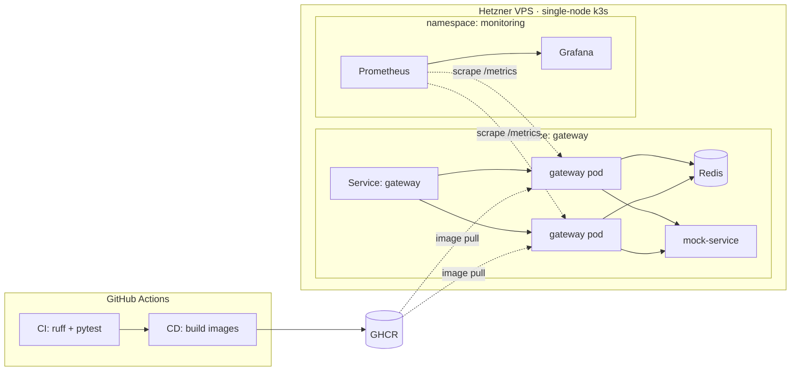
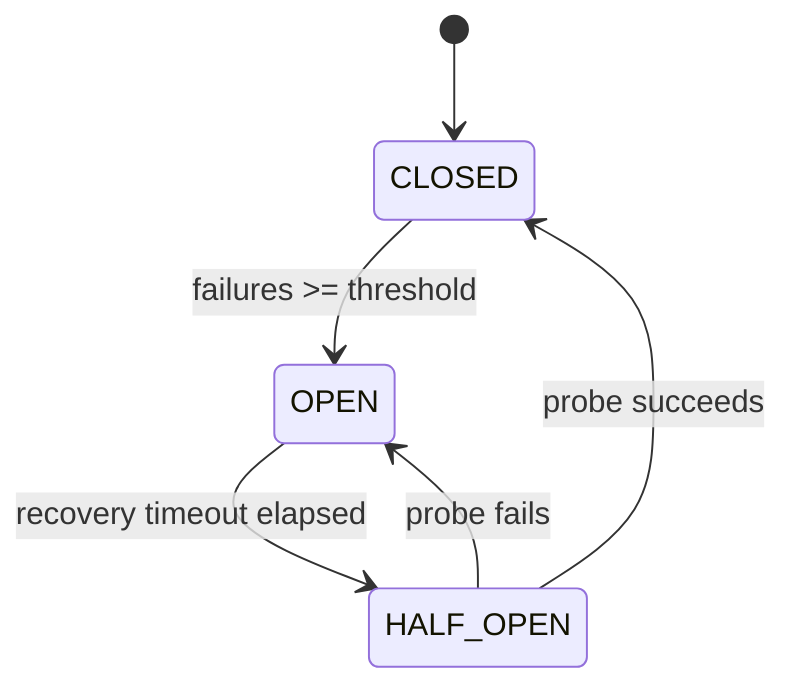

# API Gateway

A reverse-proxy API gateway built with FastAPI, httpx and Redis. It routes
requests by path, rate-limits per client IP, caches responses, checks JWTs and
trips a circuit breaker when a downstream fails. All shared state lives in
Redis, so any number of gateway replicas behave as one.

It runs on a self-managed single-node **k3s** cluster on a Hetzner VPS. GitHub
Actions tests every change and publishes the images to GHCR, and
**Prometheus + Grafana** track traffic, errors, latency and breaker state.


```mermaid
flowchart LR
    subgraph GH["GitHub Actions"]
        CI["CI: ruff + pytest"] --> CD["CD: build images"]
    end
    CD --> GHCR[("GHCR")]

    subgraph K3S["Hetzner VPS · single-node k3s"]
        subgraph APP["namespace: gateway"]
            SVC["Service: gateway"] --> GW1["gateway pod"]
            SVC --> GW2["gateway pod"]
            GW1 --> R[("Redis")]
            GW2 --> R
            GW1 --> M["mock-service"]
            GW2 --> M
        end
        subgraph MON["namespace: monitoring"]
            P["Prometheus"] --> G["Grafana"]
        end
    end

    GHCR -. image pull .-> GW1
    GHCR -. image pull .-> GW2
    P -. scrape /metrics .-> GW1
    P -. scrape /metrics .-> GW2
```

## Features

| Feature | How it works |
|---|---|
| Routing | Longest-prefix match on the path; optional prefix stripping |
| Rate limiting | Fixed-window counter per client IP in Redis (atomic Lua); each route sets its own limit; temporary bans |
| Retries | Exponential backoff on timeouts and configurable 5xx codes |
| Circuit breaker | CLOSED → OPEN → HALF_OPEN per downstream, state shared through Redis |
| Response cache | Redis cache for successful GETs; TTL and invalidation via the admin API |
| JWT auth | Bearer tokens, required per route |
| Observability | JSON logs with a request ID carried end to end; Prometheus metrics at `/metrics` |
| Admin API | `/admin/*` to inspect and reset breakers, limits, bans and cache |
| Mock service | Fake downstream with failure injection, for demos and tests |

## Project structure

```
.
├── .github/workflows/
│   ├── main.yml               # CI: ruff + pytest against a Redis service container
│   └── cd.yml                 # CD: build both images, push to GHCR
│
├── k8s/                       # Kubernetes manifests, applied in numeric order
│   ├── 00-namespace.yaml
│   ├── 10-redis.yaml          # PVC + Deployment + Service
│   ├── 20-gateway-config.yaml # ConfigMap + placeholder Secret
│   ├── 30-gateway.yaml        # Deployment (2 replicas, scrape annotations) + Service
│   ├── 40-mock-service.yaml   # Deployment + Service
│   └── monitoring/            # Prometheus, Grafana, dashboard
│
├── terraform/                 # Earlier AWS target, kept as reference
│
└── gateway/
    ├── main.py                # FastAPI app, lifespan, middleware wiring
    ├── config.yaml            # Route table + all tunable settings
    ├── mock_service.py        # Fake downstream with failure injection
    ├── Dockerfile, Dockerfile.mock, docker-compose.yml
    ├── core/                  # Settings loader, JSON logging, Redis pool
    ├── services/              # proxy + retry, rate limiter, circuit breaker, cache, auth
    ├── routers/               # proxy catch-all, admin API, /metrics
    ├── utils/middleware.py    # Logging middleware (request ID, latency)
    └── tests/test_gateway.py  # 23 unit + integration tests
```

## Quick start

### Docker Compose

```bash
cd gateway
docker compose up --build
```

Gateway on `localhost:8000`, mock service on `localhost:8010`, Redis on `localhost:6379`.

### Local development

```bash
docker run -d -p 6379:6379 redis:7-alpine
cd gateway
pip install -r requirements.txt
uvicorn mock_service:app --port 8010 &
uvicorn main:app --port 8000 --reload
```

### Any Kubernetes cluster

The manifests pull the public images from GHCR, so they work on minikube, k3s or
any other cluster without building anything locally.

```bash
kubectl apply -f k8s/
kubectl -n gateway get pods -w
kubectl -n gateway port-forward svc/gateway 8000:8000
```

## Deployment: Hetzner + k3s

| | |
|---|---|
| Server | Hetzner CX23: 2 vCPU, 4 GB RAM, Ubuntu 26.04 LTS |
| Hardening | Non-root user, key-only SSH, root login disabled, UFW allowing 22/80/443 plus the k3s pod and service ranges |
| Kubernetes | k3s, single node; bundles Traefik, CoreDNS and the local-path storage provisioner |
| Images | Pulled straight from public GHCR; no registry credentials on the cluster |

### First deploy

```bash
kubectl apply -f k8s/

# Replace the placeholder JWT key from the repo with a random one
kubectl create secret generic gateway-secret -n gateway \
  --from-literal=JWT_SECRET_KEY="$(openssl rand -hex 32)" \
  --dry-run=client -o yaml | kubectl apply -f -
kubectl -n gateway rollout restart deploy/gateway
```

> Re-applying `20-gateway-config.yaml` resets the Secret to the placeholder.
> After changing the ConfigMap, run the secret command again.

### Updating

A push to `main` runs CI, then CD publishes `:gateway` and `:gateway-<sha>`.
The pods use `imagePullPolicy: Always`, so a restart picks up the new image:

```bash
kubectl -n gateway rollout restart deploy/gateway
kubectl -n gateway rollout status deploy/gateway
```

Every build keeps a SHA tag, so rolling back is one command:

```bash
kubectl -n gateway set image deploy/gateway \
  gateway=ghcr.io/dimitriosdalaklidhs/api-gateway:gateway-<sha>
```

### Kubernetes design notes

- **Redis uses `strategy: Recreate`.** A ReadWriteOnce volume mounts on one node
  at a time, so a rolling update would wait forever for the old pod to release it.
- **`subPath` mounts do not hot-reload.** Editing the ConfigMap needs a
  `rollout restart` before the change takes effect.
- **There is no `depends_on`.** Gateway pods can start before Redis is ready;
  they report degraded until it answers, then recover. The system converges
  rather than sequences.
- **Redis persistence is optional here.** AOF is on so the PVC does something,
  but the data is rate-limit counters and cache: losing it costs one window and
  a cold cache. Compose runs Redis with persistence off for that reason.

## Shared state across replicas

Breaker state lives in Redis, so a breaker tripped through one gateway pod is
open on all of them.

```bash
kubectl -n gateway scale deploy/gateway --replicas=4

# Failure mode is in-memory on each mock pod, so set it on every one
for p in $(kubectl -n gateway get pods -l app=mock-service -o name); do
  kubectl -n gateway exec $p -- \
    curl -sX POST "http://localhost:8010/mock/failure-mode?enabled=true&rate=1.0&status=503"
done

# With the port-forward from Quick start running. POSTs skip the cache, so each
# one reaches the failing downstream (threshold is 5)
for i in $(seq 1 6); do
  curl -s -o /dev/null -X POST -H 'Content-Type: application/json' -d '{"name":"demo"}' \
    http://localhost:8000/mock/users
done

# Every replica reports OPEN, including the ones that never saw a failure
for p in $(kubectl -n gateway get pods -l app=gateway -o name); do
  kubectl -n gateway exec $p -- curl -s http://localhost:8000/admin/circuit-breakers
done
```

## Monitoring

The gateway serves Prometheus metrics at `/metrics`:

| Metric | Meaning |
|---|---|
| `http_requests_total{handler,method,status}` | Requests by status class (2xx/4xx/5xx) |
| `http_request_duration_highr_seconds` | Latency histogram, for p50/p95/p99 |
| `gateway_circuit_breaker_state{route,target}` | 0 = CLOSED, 1 = HALF_OPEN, 2 = OPEN |
| `gateway_circuit_breaker_failures{route,target}` | Failures counted toward opening |
| `gateway_redis_up` | Whether the replica could read breaker state from Redis |

Breaker gauges are read from Redis at scrape time, so every replica reports the
same shared state. Health probes and scrapes are left out of the HTTP metrics.

`k8s/monitoring/` is sized for the 4 GB node:

- **Prometheus** finds gateway pods by their `prometheus.io/*` annotations and
  scrapes each replica directly rather than through the Service, which would hit
  a random pod each time. Its RBAC is a Role that can only list pods in the
  `gateway` namespace. 15s scrapes, 3 days / 1 GB retention, `emptyDir` storage.
- **Grafana** is provisioned entirely from code: the datasource and an
  *API Gateway* dashboard with request rate, 5xx rate, latency percentiles,
  breaker state per route, Redis status and traffic per replica.

Neither is exposed publicly. Grafana is reached through an SSH tunnel:

```bash
kubectl apply -f k8s/monitoring/00-namespace.yaml
kubectl create secret generic grafana-admin -n monitoring \
  --from-literal=password="$(openssl rand -base64 18)"
kubectl apply -f k8s/monitoring/

# On your PC: tunnel port 3000 to the server
ssh -L 3000:localhost:3000 <user>@<server>
# In that SSH session
kubectl -n monitoring port-forward svc/grafana 3000:3000
# Open http://localhost:3000 and sign in as admin
```

Run the shared-state demo above and the dashboard shows the 5xx rate spike and
the `/mock` breaker turn red.

## Configuration

Everything lives in `gateway/config.yaml`; environment variables override it.

```yaml
routes:
  - path: "/payments"          # matched by prefix
    target: "http://pay-service:8005"
    rate_limit: 30             # requests per window per IP on this route
    strip_prefix: false        # true forwards /payments/invoices as /invoices
    methods: ["GET", "POST"]
    auth_required: true        # require a Bearer JWT

rate_limiting:
  default_limit: 100
  window_seconds: 60
  ban_duration_seconds: 300

circuit_breaker:
  failure_threshold: 5         # failures before OPEN
  recovery_timeout_seconds: 30 # time in OPEN before HALF_OPEN
  half_open_max_calls: 3       # probes allowed in HALF_OPEN
```

| Variable | Overrides |
|---|---|
| `REDIS_HOST`, `REDIS_PORT` | Redis address |
| `JWT_SECRET_KEY` | JWT signing key (a Secret under Kubernetes) |

Two things that break routes silently:

- `strip_prefix` must match what the downstream serves, or every request 404s.
- `target` is a hostname that must resolve where the gateway runs (a Compose
  service or Kubernetes Service name). Renaming the Service breaks the route.

Rate limits key on the TCP peer address, never on `X-Forwarded-For`, which the
client controls. Behind a load balancer, set `FORWARDED_ALLOW_IPS` to its address
so uvicorn trusts the header from that peer only.

## API reference

```bash
# Get a JWT (demo: any username and password are accepted)
curl -X POST http://localhost:8000/auth/token \
  -H "Content-Type: application/json" -d '{"username": "alice", "password": "any"}'
curl http://localhost:8000/users -H "Authorization: Bearer <token>"

# Proxy through the unauthenticated /mock route
curl http://localhost:8000/mock/users
curl http://localhost:8000/mock/orders
curl "http://localhost:8000/mock/mock/slow?delay=3"   # mock's own helpers sit under its /mock prefix

# Admin
curl http://localhost:8000/admin/health
curl http://localhost:8000/admin/circuit-breakers
curl -X POST http://localhost:8000/admin/circuit-breakers/reset
curl http://localhost:8000/admin/rate-limit/1.2.3.4
curl -X POST "http://localhost:8000/admin/rate-limit/1.2.3.4/ban?duration=600"
curl -X POST "http://localhost:8000/admin/cache/invalidate?pattern=*"

# Failure injection on the mock service (Compose / local)
curl -X POST "http://localhost:8010/mock/failure-mode?enabled=true&rate=0.7&status=503"
curl -X POST "http://localhost:8010/mock/failure-mode?enabled=false"
```

Response headers:

| Header | Meaning |
|---|---|
| `X-Request-ID` | The client's ID if it sent one, else a new UUID; forwarded downstream and logged |
| `X-RateLimit-Limit` / `X-RateLimit-Remaining` | Limit for this route and requests left in the window |
| `X-Response-Time-Ms` | Gateway latency |
| `X-Cache` | `HIT` when served from the cache |

## Tests

```bash
cd gateway
PYTHONPATH=. pytest tests/ -v --asyncio-mode=auto   # 23 passed
```

Redis is mocked in memory, so no infrastructure is needed. Coverage: rate limiter
(allow, block, ban, reset), every breaker transition, proxy forwarding, retries
and retry exhaustion, JWT create/decode/reject, and integration tests for health,
tokens, unknown routes, spoofed `X-Forwarded-For`, request-ID propagation and
`/metrics`, including a Redis outage.

## CI/CD

**CI** runs on every push to `main` or `dev` and on pull requests: a Redis 7
service container, Python 3.12.14 (the same as the image), `ruff` lint, then
the test suite.

**CD** runs after CI succeeds on `main`, on the exact commit CI tested. It builds
the gateway and mock images and pushes them to GHCR with a moving tag and a SHA
tag, authenticated by the workflow's own `GITHUB_TOKEN`, so no registry secrets
exist.

**Pinned versions.** The base image is pinned to `python:3.12.14-slim` and CI
uses the same interpreter, so a rebuild can't change Python underneath the code.
`ruff` is pinned with an explicit rule set in `ruff.toml`, after an unpinned
release turned the build red with no code change. Porting to Kubernetes also
caught a startup crash: the image passed `--log-config /dev/null`, and
`logging.config.fileConfig` rejects an empty file. It now uses `--no-access-log`.

## Infrastructure as code (AWS, reference)

`terraform/` defines the earlier AWS target: an EC2 instance, an ECR repository,
a security group, an IAM instance profile, a budget alert and a CloudWatch alarm.
The AWS account has been decommissioned, and this configuration was never applied;
`init`, `fmt` and `validate` pass without credentials.

Two choices worth noting:

- **An instance profile instead of static keys.** The instance gets short-lived
  ECR credentials through the metadata service, with IMDSv2 enforced. That
  matters for a service whose job is proxying requests to URLs.
- **`ignore_changes = [ami]`.** The AMI lookup re-resolves on every plan, so a
  new Ubuntu build would otherwise show as an instance replacement.

## Architecture notes

### Request lifecycle

1. Logging middleware assigns or keeps the request ID
2. Longest-prefix route match, then method check
3. JWT validation, if the route requires it
4. Ban check, then the rate limit (an atomic Lua script)
5. Cache lookup, for GETs
6. Circuit breaker guard
7. Proxy with retries and backoff
8. Breaker update, cache write, `X-*` headers, response log

### Why Lua for rate limiting

The limiter increments a counter and sets its expiry on the first hit. Done as
two separate commands, a crash between them leaves a counter with no TTL, and
that client stays limited forever. The Lua script runs both atomically on the
Redis server.

### Circuit breaker


```mermaid
stateDiagram-v2
    [*] --> CLOSED
    CLOSED --> OPEN: failures >= threshold
    OPEN --> HALF_OPEN: recovery timeout elapsed
    HALF_OPEN --> CLOSED: probe succeeds
    HALF_OPEN --> OPEN: probe fails
```

## Known limitations

- **Single node.** No control-plane HA and no replicated storage; losing the VPS
  takes everything down. A multi-node setup would add etcd quorum, MetalLB and
  Longhorn.
- **Deploys are a manual `rollout restart`.** CD publishes images but doesn't
  touch the cluster yet.
- **Not exposed publicly yet.** No Ingress or TLS. `/admin/*` and `/metrics`
  have no auth, which is only acceptable while the Service stays internal.
- **Demo auth.** `/auth/token` issues a token for any credentials.
- **Fixed-window limiting.** A client can send up to twice the limit across a
  window boundary; a sliding window would smooth that out.
- **Prometheus history is ephemeral** (`emptyDir`), a deliberate cost trade-off.
- **CI covers the Python only.** Manifests and Terraform are validated by hand.

## Author

**Dimitrios Dalaklidis** · [GitHub](https://github.com/DimitriosDalaklidhs)
